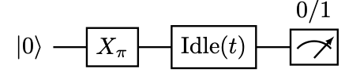

# Yaqcs Architecture Tutorial
This document is dedicated to provide a tutorial run of an example `t1` program measuring the relaxation time of a qubit.

## $T_1$: Measuring the relaxation time of a qubit
The thermal relaxation time of a qubit, often called $T_1$, is defined as the time needed for a qubit to move from the excited state |1⟩ to the ground state |0⟩. $T_1$ is one of the most fundamental characterizations of the quality of a qubit.

To measure $T1$, a qubit is first prepared in an initial |0⟩ state, acted upon by a pi-pulse to |1⟩, and measured under the computational basis after a variable time interval $t$. This experiment is repeated $N$ times to get an empirical frequency $\hat{p}(t)$ of observing the result $1$, called the *survival rate*. The survival rates are then fit to an exponential curve $A+B\cdot \exp\{-t/T_1\}$ to get an estimate of $T_1$. See below for a illustrative circuit of the $T_1$ experiment.

 

## Demo program

Below is a demo program `t1.cpp` for measuring the T1 of a qubit. It takes three parameters, respectively the maximum delay time and step size of the delay times selected, and the number of repeats for each experiment. It then performs the quantum programs and get the survival rates. Each pair of delay time and survival rate is returned to the upper PC at the end of the iteration. The data post-processing is delegated to the upper PC at the moment. The program can be found at `programs/cpp/calibration/t1.cpp`.

    #include "yqe.h"
    const int DELAY_RESET = 100, DELAY_X = 100, TRIGGER_INTERVAL = 1000;

    int main() {
    // Initialization
    int result;
    *ADDR_TRIGGER_BITMASK = BITMASK;
    *ADDR_TRIGGER_INTERVAL = TRIGGER_INTERVAL;
    *ADDR_OFFSET = 0;
    ADDR_PARAMS[CHANNEL_1Q(0)][0] = 0.0; // pulse initial phase
    ADDR_PARAMS[CHANNEL_1Q(0)][2] = 1.0; // pulse amplitude multiplier

    // Read parameters
    int t1_delay_max = int(ADDR_SRAM[0]);
    int t1_delay_step = int(ADDR_SRAM[1]);
    int t1_repeat = int(ADDR_SRAM[2]);

    // Measure the survival rate after a certain time after excitation
    for (int t1_delay = 0; t1_delay < t1_delay_max; t1_delay += t1_delay_step) {
        ADDR_PLAY[CHANNEL_1Q(0)] = WAVEFORM_RESET;
        *ADDR_WAIT = DELAY_RESET;
        ADDR_PLAY[CHANNEL_1Q(0)] = WAVEFORM_PI;
        *ADDR_WAIT = DELAY_X;
        *ADDR_WAIT = t1_delay;
        ADDR_PLAY[CHANNEL_1Q(0)] = WAVEFORM_MEAS;
        trigger(t1_repeat);
        result = ADDR_FMR[0];

        // Output delay time and survival count
        *ADDR_PCIE = t1_delay;
        *ADDR_PCIE = result;
    }
    return 0;
    }
## Execution
Before running the `t1` program, we need to first specify the three parameters needed to run the program. Those parameters are hardcoded into the program in the `t1_demo` example, but requires explicit specification for flexibilities of parameter adjustment. On the hardware, those parameters will be stored in the SRAM, as indicated by the use of `ADDR_SRAM` in those example programs. On the simulator, for simplicity of implementation, those parameters are given through the text file `params.txt`.

The program `t1` takes 3 parameters: The maximum delay, the step size of the delay, and the number of times to repeat the experiment for each delay value. Open the text file `params.txt` (the `nano` text editor installed in the docker image can be used), and change the contents to:
```
3
500
50
1000
```
The "3" on the first line indicates the number of parameters, and each subsequent line contains one parameter.

After setting the parameters, the program can be run:
```bash
./test.sh t1
```
You can change the parameters to different values, and observe the change in the behavior of the program.

`t1` outputs the following messages upon execution:

    root@024c0416c82f:/yaqcs-arch/programs# ./test.sh t1
    Number of arguments: 3
    New argument loaded: 100.000000
    New argument loaded: 50.000000
    New argument loaded: 1000.000000
    Trigger 1000 time(s) with interval 1000 and bitmask 0xffffffff
    1000
    0 0 127 0 0 1 0
    100 0 0 0 0 1 0
    200 0 128 0 0 1 0
    ----
    Fetch results from 0x40003000
    The result is 989
    Output to upper PC: Address = 0x0, length = 4, value = 0
    Output to upper PC: Address = 0x0, length = 4, value = 989
    Trigger 1000 time(s) with interval 1000 and bitmask 0xffffffff
    1000
    0 0 127 0 0 1 0
    100 0 0 0 0 1 0
    250 0 128 0 0 1 0
    ----
    Fetch results from 0x40003000
    The result is 973
    Output to upper PC: Address = 0x0, length = 4, value = 50
    Output to upper PC: Address = 0x0, length = 4, value = 973
    RISC-V simulator completed with code 0

Each round the output consist of two integers: One indicating the T1 delay time and the other the survival count. The last line indicates successful execution of the RISC-V program. A line-by-line explanation of the output can be found at `workflow.md`.