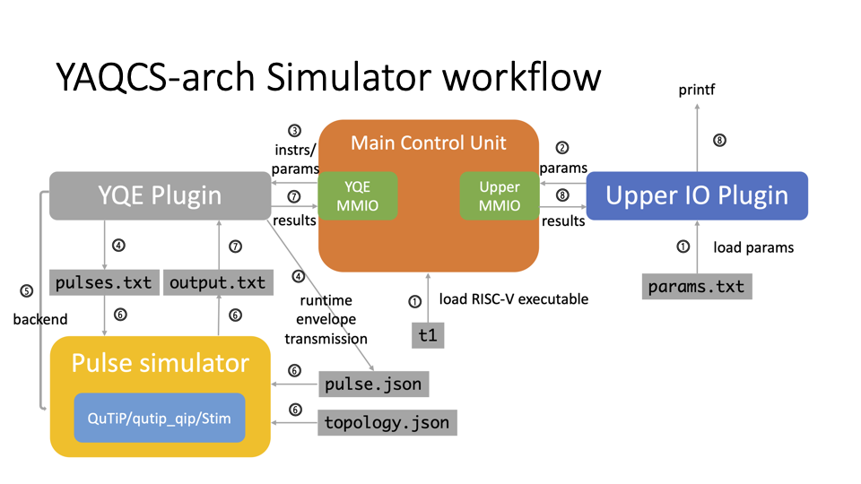

# Yaqcs Architecture Workflow

This document is dedicated to provide an overview of the workflow of the yaqcs architecture simulator, which closely reflects the actual workflow on a quantum platform supported by the YQE.

## Workflow

Lying in the center of the architectural design is a main control unit implemented on a master FPGA with a RISC-V ISA. The main control unit interacts with both the upper PC and the control electronics via memory mapped IO (MMIO). The main control unit takes commands and possible parameters from the upper PC, and runs a corresponding RISC-V program. Upon receiving pulse sequence specifications from the main control unit via MMIO, the control electronics assemble corresponding pulse sequences in the buffer and play them synchronously upon receiving a `trigger` signal. The digitizers then return the measurement result to the main control unit, again through MMIO. The main control unit aggregates the measurement results, performs necessary post-processing, and send results back to the upper PC if necessary.

The simulation workflow is illustrated below.  

The main control unit, along with the MMIO functionalities, are simulated via a QEMU RISC-V simulator supporting MMIO plugins. The control electronics and the quantum hardware is simulated via a Python-based pulse simulation backend that connects to `qutip`, `qutip_qip` or `stim`. The overall simulation workflow goes as follows.

1. The main control unit loads a RISC-V executable (here a program `t1` for the T1 experiment). The configurable parameters of the experiment, in this case specifications of the delay times, is written to `params.txt` before the program execution and is read by the upper IO plugin to simulate transmission of parameters from the upper PC to the main control unit.
2. The first step of executing the `t1` program is to read the loaded parameters from the upper PC to the main control unit via MMIO.
3. During execution of the program, the main control unit sends pulse instructions and corresponding parameters (amplitudes, phases, etc) to the control electronics. Pulse instructions are currently expanded to MMIO write instructions and processed by the Alibaba Quantum Electronics (YQE) plugin.
4. The YQE plugin generates `pulses.txt` specifying the pulse sequence to be interpreted by the pulse simulator. In some occasions, the pulse envelopes are to be generated in runtime, which is realized by the runtime envelope transmission functionality by the YQE plugin.
5. With the pulse sequences ready, the YQE plugin initiates pulse simulation with appropriate pulse simulation backend via a Python script.
6. The pulse simulator takes three input files: `pulse.txt` specifies the envelope data for each individual pulse; `topology.json` specifies the mapping of each AWG channel to the corresponding hamiltonians, and the qubit topology information; `pulses.txt` specifies the pulse sequence to be played. The pulse simulator then performs pulse simulation, and outputs the measurement result to `output.txt`.
7. The YQE plugin constantly checks if `output.txt` is ready. When `output.txt` has been written, the YQE plugin reads the measurement results and returns them to the main control unit. 
8. The main control unit performs necessary aggregation of the measurement results and uploads the result to the upper PC, completing the entire workflow. The uploaded results are now simply printed through `printf`.

## MMIO spec

A complete MMIO specification can be found at `programs/yqe.h`.

  * Basic functionalities
    * `ADDR_TRIGGER`: Issue triggers with given number of repetitions for executing previously issued pulses
    * `ADDR_PLAY`: Issue pulse commands to specified control electronics
    * `ADDR_WAIT`: Increment global clock for pulse scheduling
    * `ADDR_FMR`: Retrieve measurement results from control electronics
    * `ADDR_PARAMS`: Specify detailed pulse parameters for upcoming pulse issuing
  * Upper PC IO
    * `ADDR_PCIE`: Output program results to upper PC
    * `ADDR_SRAM`: Receive program parameters from upper PC
  * Fetch-measurement-result (FMR) related
    * `ADDR_FMR_IQ`: Retrieve (demodulated) measurement IQ results from control electronics
    * `ADDR_OFFSET`: Specify return address offset relative to ADDR_FMR
  * Trigger related
    * `ADDR_TRIGGER_INTERVAL`: Specify time interval between two consecutive triggers
    * `ADDR_TRIGGER_BITMASK`: Specify which channels are activated for upcoming trigger
  * Pulse transmission
    * `ADDR_ENVELOPE`: Specify 14-bit resolution pulses
    * `ADDR_WAVE_LEN`: Specify length of waveform
    * `ADDR_WAVE_CHANNEL`: Specify to which control electronics is the envelope to be transmitted
    * `ADDR_WAVE_INDEX`: Specify to which pulse index of the given control electronics is the envelope to be transmitted

## Simulator input/ output

Below is a demo program `t1.cpp` for measuring the T1 of a qubit, also present in `tutorial.md`.

    #include "yqe.h"
    const int DELAY_RESET = 100, DELAY_X = 100, TRIGGER_INTERVAL = 1000;

    int main() {
    // Initialization
    int result;
    *ADDR_TRIGGER_BITMASK = BITMASK;
    *ADDR_TRIGGER_INTERVAL = TRIGGER_INTERVAL;
    *ADDR_OFFSET = 0;
    ADDR_PARAMS[CHANNEL_1Q(0)][0] = 0.0; // pulse initial phase
    ADDR_PARAMS[CHANNEL_1Q(0)][2] = 1.0; // pulse amplitude multiplier

    // Read parameters
    int t1_delay_max = int(ADDR_SRAM[0]);
    int t1_delay_step = int(ADDR_SRAM[1]);
    int t1_repeat = int(ADDR_SRAM[2]);

    // Measure the survival rate after a certain time after excitation
    for (int t1_delay = 0; t1_delay < t1_delay_max; t1_delay += t1_delay_step) {
        ADDR_PLAY[CHANNEL_1Q(0)] = WAVEFORM_RESET;
        *ADDR_WAIT = DELAY_RESET;
        ADDR_PLAY[CHANNEL_1Q(0)] = WAVEFORM_PI;
        *ADDR_WAIT = DELAY_X;
        *ADDR_WAIT = t1_delay;
        ADDR_PLAY[CHANNEL_1Q(0)] = WAVEFORM_MEAS;
        trigger(t1_repeat);
        result = ADDR_FMR[0];

        // Output delay time and survival count
        *ADDR_PCIE = t1_delay;
        *ADDR_PCIE = result;
    }
    return 0;
    }

`t1` outputs the following messages upon execution:

    root@024c0416c82f:/yaqcs-arch/programs# ./test.sh t1
    Number of arguments: 3
    New argument loaded: 100.000000
    New argument loaded: 50.000000
    New argument loaded: 1000.000000
    Trigger 1000 time(s) with interval 1000 and bitmask 0xffffffff
    1000
    0 0 127 0 0 1 0
    100 0 0 0 0 1 0
    200 0 128 0 0 1 0
    ----
    Fetch results from 0x40003000
    The result is 989
    Output to upper PC: Address = 0x0, length = 4, value = 0
    Output to upper PC: Address = 0x0, length = 4, value = 989
    Trigger 1000 time(s) with interval 1000 and bitmask 0xffffffff
    1000
    0 0 127 0 0 1 0
    100 0 0 0 0 1 0
    250 0 128 0 0 1 0
    ----
    Fetch results from 0x40003000
    The result is 973
    Output to upper PC: Address = 0x0, length = 4, value = 50
    Output to upper PC: Address = 0x0, length = 4, value = 973
    RISC-V simulator completed with code 0

The output message can be broken down as follows:
* The first 4 lines are reading parameters from the `params.txt`. In this case there are three parameters, namely maximum delay time (set to `100`), step increment of delay time (set to `50`), and the number of repeated measurements for each delay time (set to `1000`). 
* The following blocks each indicate one particular set of repeated measurements (2 in total). 
  * Each block starts by a trigger message, indicating how many times the following experiment is to be triggered and with how long an interval for each individual experiment. 
  * The following lines are the content of the pulse instructions to be written to `pulses.txt`. 
    * The first line indicates the number of repeats. 
    * The follwing lines each represent one pulse instruction. The seven numbers are correspondingly the amount of time after trigger when the pulse is to be played, the channel where the pulse is to be played, the index of the pulse envelope, and up to four configurable parameters for real-time pulse modulation. Right now the 1st and the 3rd parameters indicate the phase and amplitude of the pulse (`0` and `1` in this case), whereas the other parameters are reserved for future use.
  * `----` are printed immediately after the pulse sequences. 
  * The next two lines are the main control unit reading measurement results from the YQE plugin. It reads from the address `ADDR_FMR=0x40003000` the aggregated measurement results.
  * The next two lines indicate output of the experimental result to the upper PC. In this case, the delay time and the survival count are directly transmitted to the upper PC.
* The last line indicates that the RISC-V simulator successfully terminates, indicating a successful run.